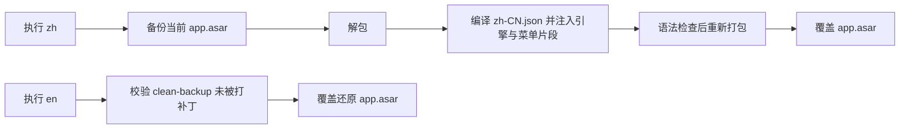

# antigravity-zh

为 [Google Antigravity](https://antigravity.google/) 桌面端提供简体中文界面，并保留一条命令还原官方英文的退路。


## 它做什么

Antigravity 桌面端目前只有英文界面。本工具解包应用的 `app.asar`，向渲染进程注入一段翻译引擎和一份词典，重新打包后界面即为中文。首次运行会保存一份官方原始归档，`en` 命令直接用它覆盖回去，恢复结果与安装时逐字节相同。

当前语言包含 609 条静态词条、28 条原生菜单词条和 13 条动态规则（用于`Thought for 5s`、`3 tasks running`这类含运行时数值的文本）。

## 安装与使用

需要 Node.js 16 或更高版本。

```bash
# 切换为中文
npx antigravity-zh zh

# 还原官方英文
npx antigravity-zh en

# 查看当前语言、安装路径与备份状态
npx antigravity-zh status
```

也可以克隆源码运行：

```bash
git clone https://github.com/wadewu-ml/antigravity-zh.git
cd antigravity-zh
npm install
node bin/cli.js zh
```

### 命令与参数

```text
Commands:
  zh                切换为简体中文
  en                还原官方原版英文
  status            查看当前语言、安装路径与备份状态
  locales           列出内置的语言包

Options:
  --app-dir <path>  指定 Antigravity 安装目录（未装在默认路径时使用）
  --locale <code>   指定语言包（默认 zh-CN）
  --no-restart      补丁完成后不自动重启应用
  --no-kill         不主动关闭 Antigravity（需自行先关闭）
  --force           跳过优雅关闭等待，立即强制结束进程
  -h, --help        查看帮助
  -v, --version     查看版本号
```

## 重要须知

**这是一个修改应用文件的工具，请在动手前读完本节。**

- **需要关闭 Antigravity。** 改写 `app.asar` 要求应用未运行。工具会先请求正常退出并等待最多 20 秒让它保存状态，超时才强制结束。请自行保存未完成的工作，或先手动关闭应用再配合 `--no-kill` 使用。
- **官方更新会覆盖补丁。** Antigravity 自动更新会替换 `app.asar`，界面将回到英文，重新执行 `zh` 即可。更新后新增的界面文本可能尚未收录在词典中。
- **务必保留备份文件。** 首次运行会在应用的 `resources` 目录生成 `app.asar.clean-backup`，这是还原英文的唯一依据；每次切换还会另存一份带时间戳的备份。删除 `clean-backup` 且没有其他未打补丁的备份时，只能重装或等待官方更新来恢复。
- **可能影响应用的完整性校验与技术支持。** 修改过的客户端可能无法通过官方签名或完整性检查，也可能影响你从官方获得支持的资格。遇到任何异常，请先执行 `en` 还原为官方原版，再判断问题是否与本工具有关。
- **翻译只覆盖界面文本。** 模型的回复内容、代码、终端输出、你自己输入的文字都不会被改动。

## 安全与隐私

本工具在本地运行，不联网，不收集任何数据。具体来说：

- 代码中没有任何网络请求、遥测或统计上报，你可以检索 `fetch`、`http`、`XMLHttpRequest` 自行确认。
- 注入到应用中的翻译引擎只读写 DOM 文本节点和少量无障碍属性，不接触 `localStorage`、Cookie、IPC 通道，也不读取会话内容、账号信息或 API 凭据。
- 代码编辑器（Monaco）、终端（xterm）、可编辑区域与日志区域被显式排除在翻译范围之外，你的代码和命令输出不会被改写。
- 唯一被修改的文件是应用安装目录下的 `app.asar`，以及同目录内由本工具生成的备份和状态文件。不写注册表，不安装服务，不创建自启动项。
- 调用外部程序时一律以参数数组传递路径，不经过 shell 拼接，因此含特殊字符的路径无法被解释为命令。

## 工作原理



翻译引擎与语言数据完全分离：`src/patches/engine.jsfrag` 不含任何语言内容，词条、动态正则、标点映射全部由 `src/locales/zh-CN.json` 提供，构建时注入。引擎通过 `MutationObserver` 跟踪 React 的动态渲染，因此路由切换、弹窗、异步加载的内容也会被翻译。

注入块由哨兵注释界定，重复执行不会叠加，同一输入产出的归档逐字节一致。

## 项目结构

```text
bin/cli.js                     命令行入口
src/index.js                   补丁注入与还原调度
src/detector.js                安装路径探测与进程管理
src/locale.js                  语言包加载、校验与片段编译
src/locales/zh-CN.json         简体中文语言数据
src/locales/locale.schema.json 语言包字段契约
src/patches/engine.jsfrag      语言中立的 DOM 翻译引擎模板
src/patches/menu.jsfrag        语言中立的原生菜单模板
test/                          语言包、DOM 遍历与注入幂等性测试
```

## 参与贡献

发现未翻译或翻译不当的界面文本，在 [`src/locales/zh-CN.json`](./src/locales/zh-CN.json) 的 `text` 字典里增改一行即可：

```json
"Original Text": "中文翻译"
```

提交前运行 `npm test` 校验语言包格式。含运行时数值的文本需要新增动态规则，写法见 [CONTRIBUTING.md](./CONTRIBUTING.md)。

引擎本身不含语言数据，因此新增其他语言只需添加一个 `src/locales/<语言代码>.json`，无需改动 JS 代码。欢迎提交其他语言的语言包。

## 免责声明

本项目是独立的第三方工具，与 Google 及 Antigravity 官方团队没有任何关联，未获其授权或背书。Antigravity 是 Google 的产品，相关名称和商标归其所有者所有。

本软件按"原样"提供，不附带任何形式的明示或默示担保。使用者自行承担因使用本工具而产生的全部风险，包括但不限于应用无法启动、数据丢失、功能异常、失去官方技术支持，或违反相关服务条款可能带来的后果。作者与贡献者不对任何直接或间接损失负责。详见 [LICENSE](./LICENSE)。

请在使用前确认修改客户端不违反你所适用的 Antigravity 服务条款。若你所处的环境不允许修改应用程序，请勿使用本工具。

## 许可证

[MIT](./LICENSE)
