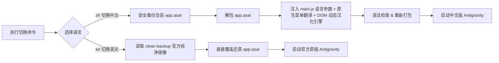

# Antigravity 简体中文语言切换补丁 (antigravity-zh)

<p align="center">
  <b>一键为 Google Antigravity 桌面端启用高品质简体中文界面，支持随时秒级切换回官方原版英文。</b><br>
  <i>One-command Simplified Chinese localization & switcher for Antigravity desktop app.</i>
</p>

<p align="center">
  
  
  
</p>

---

## ✨ 项目特性

- 🚀 **一行命令切换**：一行命令即可在**简体中文**与**官方原版英文**之间自由切换。
- 🖥️ **跨平台支持**：完整支持 **Windows** 与 **Linux**（同时兼容 macOS）。
- 🛡️ **安全无损与干净备份**：首次运行时自动生成 `app.asar.clean-backup` 官方原始镜像，支持 100% 零残留还原。
- ⚡ **响应式 DOM 动态引擎**：基于 `MutationObserver` 与 `TreeWalker`，完美适配 React 动态渲染、路由切换、抽屉弹窗及长句超链接分割。
- 🔒 **纯净安全**：不触碰底层二进制执行文件，不拦截任何模型对话、Token 与网络请求；代码编辑区（Monaco/xterm）严格隔离，保证开发体验。
- 🧩 **动态模式识别**：自动转换思考耗时（`Thought for Xs`）、限额倒计时、任务状态统计等动态信息。
- 💾 **优雅关闭优先**：切换前先请求 Antigravity 正常退出并等待其保存状态，仅在超时仍未退出时才强制结束（可用 `--force` 跳过等待）。
- 🧭 **可靠状态记录**：切换结果写入 `antigravity-zh-state.json`，`status` 命令完整扫描归档判定当前语言，不依赖固定偏移猜测。
- 🌐 **数据驱动的词典架构**：翻译引擎与语言数据完全分离，词条、动态正则规则、标点映射全部放在 `src/locales/<code>.json`，新增语言只需添加一个 JSON 文件，无需修改引擎代码。

---

## 🚀 快速上手 (Quick Start)

> [!NOTE]
> 在执行切换命令前，请确保系统已安装 [Node.js](https://nodejs.org/) (>= 16)。

### 方式一：NPX 一行命令执行（免克隆，最推荐）

```bash
# 切换为简体中文
npx antigravity-zh zh

# 切换回官方英文原版
npx antigravity-zh en

# 查看当前语言与安装路径状态
npx antigravity-zh status
```

---

### 方式二：本地仓库运行

```bash
# 克隆仓库
git clone https://github.com/wadewu-ml/antigravity-zh.git
cd antigravity-zh

# 切换为简体中文
node bin/cli.js zh

# 切换回官方英文原版
node bin/cli.js en
```

---

### 方式三：系统原生脚本

#### 🪟 Windows (PowerShell)
在外部 PowerShell 终端中执行：
```powershell
# 切换为中文
.\scripts\patch.ps1 -Lang zh

# 切换回英文
.\scripts\patch.ps1 -Lang en
```

#### 🐧 Linux / 🍎 macOS (Bash)
在终端中执行：
```bash
chmod +x scripts/patch.sh

# 切换为中文
./scripts/patch.sh zh

# 切换回英文
./scripts/patch.sh en
```

---

## ⚙️ 命令行参数说明

```text
Usage:
  npx antigravity-zh <command> [options]

Commands:
  zh                切换为简体中文 (Simplified Chinese)
  en                还原官方原版英文 (Official English)
  status            查看当前安装路径、语言状态与备份状态
  locales           查看本包内置的语言包列表

Options:
  --app-dir <path>  自定义 Antigravity 安装目录（未安装在默认路径时使用）
  --locale <code>   指定使用的翻译语言包（默认 zh-CN，可用 `locales` 命令查看）
  --no-restart      补丁完成后不自动重启应用
  --no-kill         不主动关闭 Antigravity（请自行先关闭应用）
  --force           跳过优雅关闭等待，立即强制结束 Antigravity
  -h, --help        查看帮助信息
```

---

## 🛠️ 工作原理



---

## 🤝 参与贡献与增补词条

发现有新的界面未被翻译？欢迎为本项目贡献词条！

1. 打开 [`src/locales/zh-CN.json`](./src/locales/zh-CN.json)
2. 在 `text` 字段中添加新的中英对照项：
   ```json
   "Original Text": "中文翻译"
   ```
3. 运行 `npm test` 校验语言包格式，然后提交 Pull Request。

### 新增一门语言

引擎本身不含任何语言数据，因此新增语言不需要改动 JS 代码：

1. 复制 `src/locales/zh-CN.json` 为 `src/locales/<语言代码>.json`（如 `ja-JP.json`）。
2. 翻译 `text`（静态词条）与 `menu`（原生菜单）两个字段。
3. 调整 `patterns` 中各条动态规则的 `template`，用 `{1}`、`{2}` 引用正则捕获组；
   需要按值改写的部分（如时间单位）写进 `valueMaps`。
4. 按目标语言习惯设置 `punctuation`（中文为全角映射，多数西文语言留空对象即可）与 `htmlLang`。
5. 运行 `npm test`：语言包会被逐条校验（正则可编译、模板占位符不越界、引用的值表存在），
   并用每条规则自带的 `sample` 验证匹配与输出确实生效。
6. 用 `node bin/cli.js zh --locale <语言代码>` 实机验证后提交 PR。

---

## ⚠️ 免责声明 (Disclaimer)

1. 本项目为开源社区爱好者维护的第三方本地化项目，与 Google 公司无官方关联。
2. 本工具仅对客户端前端界面进行语言渲染层修补，不修改任何核心请求、隐私数据与业务逻辑。
3. 使用本项目所产生的任何风险由使用者自行承担。

---

## 📄 开源许可证

本项目基于 [MIT License](./LICENSE) 开源。
